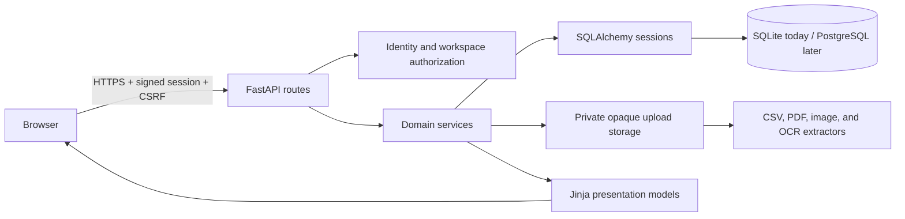

# Architecture

Where Is My Money is a server-rendered FastAPI application with deterministic financial logic. It
does not connect to banks, move money, or send financial data to an LLM.

## Request boundaries

- `app/main.py` assembles settings, middleware, stores, extractors, routers, error handlers, and the
  health endpoint.
- `app/auth/` proves identity through Google OAuth. `app/workspaces/` authorizes every private
  workspace route. A URL workspace ID never grants access by itself.
- Feature packages (`imports`, `payslips`, `accounts`, `dashboard`, `planning`, and
  `statement_imports`) keep route handling separate from domain calculations and persistence.
- SQLAlchemy sessions make multi-row writes atomic. Alembic is the only supported way to evolve the
  schema.
- Upload stores use opaque generated names below one private root. Validation checks category,
  extension/MIME agreement, request and file size, and parser/decoder validity. Failed or canceled
  workflows remove private sources according to their retention state.

## Security and observability

The browser receives HTTP-only signed sessions, signed double-submit CSRF tokens, trusted-host
validation, and defensive response headers. Production requires HTTPS-only cookies, an explicit
secret, and explicit hostnames.

Every response gets an `X-Request-ID`. Logs are one JSON object per event and accept only a small
allowlist of operational fields such as request ID, workspace/user numeric IDs, status, safe error
code, state, duration, and row count. Passwords, cookies, bearer tokens, OAuth secrets, CSRF values,
email addresses, raw file contents, filenames, and financial values must never be logged.

## Data flow for an upload

1. The route authenticates the user and authorizes the workspace.
2. Middleware bounds the request body before multipart parsing.
3. The document catalog checks the chosen category against extension and MIME type.
4. A store streams to an opaque private path while hashing and enforcing the file limit.
5. A local parser or extractor validates and produces an editable candidate.
6. The user reviews the candidate; only confirmation writes normalized financial records.
7. Retention policy either deletes the source or retains it privately. Cleanup failures are explicit
   states that can be retried.
