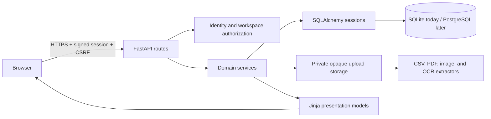

# Architecture

Where Is My Money is a server-rendered FastAPI application with deterministic financial logic. It
does not connect to banks, move money, or send financial data to an LLM.

## Request boundaries

- `app/main.py` assembles settings, middleware, stores, extractors, routers, error handlers, and the
  health endpoint.
- `app/auth/` proves identity through Google OAuth. `app/workspaces/` authorizes every private
  workspace route. A URL workspace ID never grants access by itself.
- Feature packages (`imports`, `payslips`, `accounts`, `dashboard`, `planning`, and
  `statement_imports`) keep route handling separate from domain calculations and persistence.
- SQLAlchemy sessions make multi-row writes atomic. Alembic is the only supported way to evolve the
  schema.
- Upload stores use opaque generated names below one private root. Validation checks category,
  extension/MIME agreement, request and file size, and parser/decoder validity. Failed or canceled
  workflows remove private sources according to their retention state.

## Security and observability

The browser receives HTTP-only signed sessions, signed double-submit CSRF tokens, trusted-host
validation, and defensive response headers. Production requires HTTPS-only cookies, an explicit
secret, and explicit hostnames.

Every response gets an `X-Request-ID`. Logs are one JSON object per event and accept only a small
allowlist of operational fields such as request ID, workspace/user numeric IDs, status, safe error
code, state, duration, and row count. Passwords, cookies, bearer tokens, OAuth secrets, CSRF values,
email addresses, raw file contents, filenames, and financial values must never be logged.

## Data flow for an upload

1. The route authenticates the user and authorizes the workspace.
2. Middleware bounds the request body before multipart parsing.
3. The document catalog checks the chosen category against extension and MIME type.
4. A store streams to an opaque private path while hashing and enforcing the file limit.
5. A local parser or extractor validates and produces an editable candidate.
6. The user reviews the candidate; only confirmation writes normalized financial records.
7. Retention policy either deletes the source or retains it privately. Cleanup failures are explicit
   states that can be retried.

## Workspace rule system

`app/rules/` owns typed condition validation, compilation, evaluation, lifecycle
services, signed historical-application tokens, presentation, and bounded
metrics. Routes remain workspace-authorized and server rendered. Rule writes,
tag writes, and historical confirmation share one workspace serialization key:
PostgreSQL locks the workspace row with `FOR UPDATE`; SQLite acquires its write
lock with a no-op workspace update before dependent reads.

Enabled rules compile in priority-and-ID order. The loader fetches rules, tags,
referenced categories, and referenced accounts in a constant number of queries,
then validates the recursive all/any/not tree once. Import review and metrics
reuse the compiled representation and evaluate projected transaction rows in
memory, so neither path performs a rule query per row. Invalid conditions or
inaccessible action resources produce value-free diagnostics and are excluded
fail closed.

The `transactions.merchant_rule_id` foreign key uses `ON DELETE SET NULL`.
Deleting a rule therefore preserves the committed merchant, category, tags,
Subscription state, cadence, and `categorization_source`; presentation renders a
null link with a workspace-rule source as **Deleted workspace rule**. Manual
updates clear the rule link and become protected manual decisions.

### Signed historical application

Historical mutation is a preview-confirm protocol rather than a bulk-edit
shortcut:

1. A workspace member submits allowlisted date, account, direction, and category
   filters. The service evaluates the full ordered rule set, classifies manual,
   conflict, unchanged, unavailable, and eligible rows, and caps selection at
   500 transaction IDs.
2. A redacted `rule_application_runs` row records counts and normalized
   selection metadata. A signed preview token binds its exact run ID, workspace,
   rule/version, filters, selected IDs, and current/resulting state digest.
3. Confirmation locks the workspace, rule, run, and selected transactions;
   reauthorizes membership; recomputes order and digest; and applies every action
   field in one nested transaction. Stale state produces a durable stale audit
   and no financial mutation. A confirmed retry returns the stored outcome.

Tokens are never stored in the audit table. The selection JSON contains only
allowlisted filters and positive IDs, is deeply immutable after validation, and
cannot carry descriptions or financial values.

### Correction events and metrics

`transaction_categorization_events` records only workspace and transaction IDs,
previous/new source, nullable previous/new rule IDs, a reason enum, and a
timestamp. Rule foreign keys use `ON DELETE SET NULL`; workspace and transaction
foreign keys cascade. The table deliberately has no description, merchant,
amount, category, tag, filename, or token columns. Manual, import-commit, and
historical-application services stage these rows inside the same transaction as
their financial mutation, and unchanged source/rule attribution emits no event.

The Rules page builds one bounded 90-day quality report from projected columns
and redacted events. It reports per-rule linked use, last committed use, matches,
higher-priority conflicts, protected manual matches, and later correction rate,
plus workspace coverage by source, uncategorized rate, correction rate, and
conflicting-rule rate. Preview and simulation never increment these statistics.
A database metrics failure is rolled back and the optional report becomes
`None`; the management page and rule lifecycle remain available.
Provider-dependent match/order metrics are marked unavailable when historical
provider provenance was not persisted; source coverage and unrelated metrics
remain available instead of inferring a provider or displaying a false zero.
