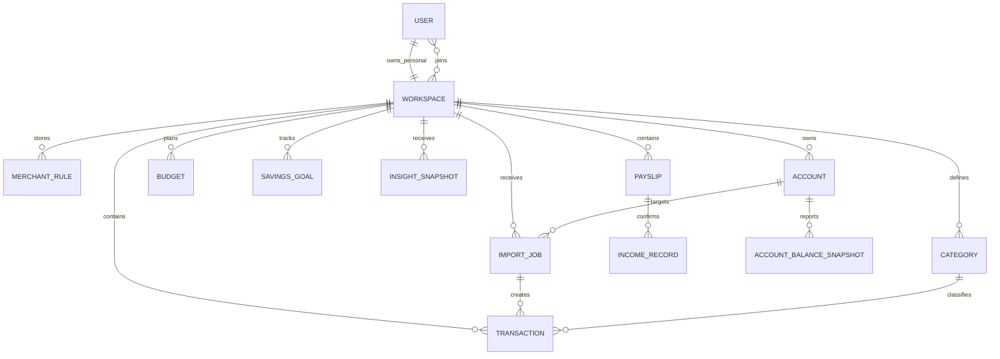

# Where Is My Money — Implementation Plan

## Summary

Build a Python-first personal-finance web app that runs locally with SQLite and can later move to PostgreSQL. It will import CSV bank and credit-card statements plus uploaded payslips, store normalized financial data, categorize spending, generate explainable insights, suggest budgets, calculate savings-goal timelines, and track account balances (checking, 401k, brokerage, mortgage, loans) to show net worth over time.

The first release uses FastAPI server-rendered pages, Google sign-in, SQLAlchemy, Alembic, SQLite, deterministic LangGraph workflows, and Docker. It does not use an LLM, bank-aggregation API, payment movement, or investment advice.

Use `uv` with Python 3.12. The currently installed system Python is 3.9.6, while current LangGraph releases require Python 3.10 or newer.

## Architecture

Use a modular monolith: one FastAPI application, organized by feature, with a relational database and service boundaries that support future replacements.

- **UI:** FastAPI, Jinja templates, HTMX, and small local JavaScript/chart assets. No separate React project.
- **Authentication:** Google OAuth with `openid`, `email`, and `profile` scopes; secure HTTP-only sessions and CSRF protection.
- **Local persistence:** SQLite at `data/where-is-my-money.db`, managed through SQLAlchemy and Alembic. Enable foreign keys and WAL mode. Run a single web process while SQLite is in use.
- **Files:** Original statement and payslip files live outside the database in private `data/uploads/` storage. Each upload lets the user retain or delete the source after successful import.
- **Future deployment:** Keep models and migrations compatible with PostgreSQL; deployment later changes `DATABASE_URL` and file storage to managed PostgreSQL and S3-compatible object storage.
- **Authorization:** Each user gets a private workspace. Users can also create shared household workspaces; all accepted members have equal access to shared data, invitations, and settings.

### Agent workflows

LangGraph coordinates deterministic, auditable workflows. It does not call an AI model in V1.

> **Design note:** Strictly speaking, V1's deterministic workflows could be plain Python service functions — LangGraph earns its keep primarily when branching/looping agent logic and an LLM arrive. LangGraph is kept in V1 **intentionally, as a learning vehicle** for this project, so the graph structure, state, and node patterns are in place before the optional LLM advisor lands in a deferred future PR. If it proves cumbersome during V1, a node can be swapped for a plain function without changing the surrounding contract.

1. **Statement import:** upload CSV → map columns → normalize dates, amounts, and merchants → detect duplicates → apply category rules → show review → save approved transactions.
2. **Payslip import:** upload PDF/image → extract text or run local OCR → identify candidate pay fields → require confirmation/correction → save confirmed income records.
3. **Account statement import:** upload CSV/PDF statement (401k, brokerage, mortgage, loan) → identify the account → extract the balance as of a date → require confirmation → save a balance snapshot linked to the account.
4. **Insights:** aggregate confirmed transactions, income, and balance snapshots → find trends, recurring charges, and category spikes → calculate net worth, budget suggestions, and goal scenarios → save evidence-backed insights.

Categorization precedence is: manual transaction choice → workspace merchant rule → built-in merchant rule → `Uncategorized`. A user can save a correction as a merchant rule for future imports.

## Database schema

Use integer cents rather than floating-point amounts. All financial records require a `workspace_id`, which prevents private and household finances from mixing.



- `users`: Google subject ID, verified email, display name, timestamps.
- `workspaces`, `workspace_memberships`, `workspace_invitations`: private and shared spaces, members, and pending invitations.
- `uploaded_files`: file type, private storage path, checksum, size, retention choice, and deletion status.
- `import_jobs`: CSV mapping, status, validation errors, source checksum, and file reference.
- `transactions`: date, description, normalized merchant, signed USD cents, category, categorization source, duplicate fingerprint, import job, and workspace.
- `categories`, `merchant_rules`: default/custom category definitions and workspace-level merchant mappings.
- `payslips`: employer, pay period, pay date, candidate extracted fields, confidence, review status, and optional file reference.
- `income_records`: confirmed gross pay, net pay, taxes, deductions, and pay date. These stay separate from bank transactions to avoid duplicating direct deposits.
- `budgets`, `savings_goals`, `insight_snapshots`: accepted category limits, savings scenarios, and report results with their supporting period.
- `accounts`: name, account type (checking, savings, credit_card, investment_401k, investment_brokerage, mortgage, auto_loan, student_loan, other), institution, `is_liability` flag, and workspace. An account is an asset (checking, 401k) or a liability (mortgage, loan).
- `account_balance_snapshots`: account, balance in signed integer cents, as-of date, source (manual or statement import), optional uploaded file reference, and workspace. The latest snapshot per account drives the net worth view. Individual investment holdings (stocks within a 401k) are a future enhancement; V1 tracks total account balances only.
- `import_jobs` gains an optional `account_id` so an import can target a specific account (added in the PR 2e migration).

Create indexes for workspace-scoped transaction dates, transaction categories, normalized merchants, and duplicate fingerprints. Index account balance snapshots by (workspace_id, as_of_date) and (account_id, as_of_date). Enforce foreign keys and a workspace-level duplicate constraint where source data permits it.

## Product behavior

- **Statements:** V1 accepts CSV files. A mapping screen supports common date, description, debit, credit, and amount headers. The user reviews all changes before they are committed.
- **Payslips:** V1 accepts PDF and image payslips. Local text extraction is tried first; scanned files use local OCR. Gross pay, net pay, taxes, deductions, employer, and pay period are editable before saving. Low-confidence fields require manual entry.
- **Insights:** Show spending by category and merchant, monthly comparisons, recurring-charge candidates, unusual spending, and income-versus-spending context. Every recommendation links to the period and transactions supporting it.
- **Budget suggestions:** Recommend a monthly category limit from the median of the prior three complete months plus a 10% buffer. Users must edit or accept a suggestion; nothing is created automatically.
- **Savings goals:** A goal has a name, target amount, current savings, and a target date or monthly contribution. The app calculates the missing value and reports whether the goal is on track.
- **Privacy boundary:** The app analyzes data and presents scenarios only. It does not connect to banks, move money, make investments, or provide individualized financial advice in V1.

## Account balances and net worth

Transactions and income records are **flows** — they show where money goes and where it comes from. Account balances are **stocks** — they show where you stand at a point in time. The app tracks both.

- **Accounts:** A workspace owns accounts of various types: checking, savings, credit card, 401k, brokerage (e.g., Robinhood, Fidelity NetBenefits), mortgage, auto loan, student loan, and other. Each account is flagged as an asset or a liability.
- **Balance snapshots:** Each imported statement (or manual entry) produces a balance snapshot — the account balance as of a date, in integer cents. The latest snapshot per account drives the net worth view.
- **Statement types:** V1 accepts CSV and PDF statements for 401k, brokerage, mortgage, and loan accounts. The import extracts the account balance and period, requires confirmation, and saves a snapshot. Individual investment holdings (specific stocks within a 401k) are a future enhancement; V1 tracks total balances only.
- **Net worth view:** The dashboard shows total assets (bank + investment accounts), total liabilities (mortgage + loans + credit card balances), and net worth (assets − liabilities) with a trend over time from balance snapshots.
- **Relationship to transactions:** Bank and credit card statements already produce transactions (where money goes). Account statement imports produce balance snapshots (where you stand). A mortgage payment appears as a transaction (the outflow) and the remaining balance appears as a snapshot (the liability). The two are independent — one does not duplicate the other.
- **Not investment advice:** Showing balances and net worth is informational. The app does not recommend buys, sells, asset allocation, or any investment strategy.

## Security and operations

These topics are called out now so they are not forgotten in later PRs. Most are implemented in PR 9 (production readiness); the auth-related ones land in PR 3.

- **Session secret storage:** The session-signing key is read from a `SECRET_KEY` environment variable via `app/core/config.py`. In local development it falls back to a generated ephemeral key with a loud warning. In production a missing `SECRET_KEY` must fail fast. Never commit a real key.
- **Google OAuth client-secret handling:** The Google client ID and client secret are read from `GOOGLE_CLIENT_ID` and `GOOGLE_CLIENT_SECRET` environment variables (loaded from a git-ignored `.env` locally). The secret never appears in logs, templates, or error messages.
- **CSRF token strategy:** All state-changing form posts (sign-in, sign-out, imports, edits, deletions) require a signed double-submit CSRF token rendered into each form and verified on the server. HTMX requests send the token via a custom header.
- **SQLite backup and restore:** Document a `sqlite3 .backup` (or file-copy under WAL checkpoint) procedure in `docs/`. Backups are taken with the app stopped or in WAL mode to avoid torn copies. Restore is a file replace followed by an Alembic stamp check.
- **Rate limiting on auth endpoints:** Apply a simple in-process rate limiter to the Google OAuth callback, sign-in, and sign-out routes to blunt brute-force and replay attempts. Replace with a shared store when a second web process is introduced (PostgreSQL migration).

## Future LLM safety policy

V1 exposes **no LLM and no LLM tools**. The deterministic LangGraph workflows are fully testable application code.

When an LLM is intentionally added, treat it as an untrusted reasoning layer. It must never receive database credentials, shell access, raw file paths, unrestricted network access, or direct ORM/database access. The backend—not the model—derives the authenticated user and authorized workspace.

Only add narrowly scoped, read-only tools that return bounded, redacted results:

- `get_spending_summary(period)`
- `get_category_comparison(period_a, period_b)`
- `get_recurring_expenses(period)`
- `get_budget_status(month)`
- `get_goal_projection(goal_id)`
- `get_net_worth(as_of_date)` returning total assets, total liabilities, and net worth from the latest snapshots per account.
- `search_transactions(filters, limit)` with server-enforced workspace scope, a small result limit, and no source-file content.

Do not expose tools that upload/read raw statements or payslips, change transactions/categories/budgets/goals, manage household members, disclose secrets, execute code, call arbitrary URLs, or move money. Any future write action must remain a normal application form with an explicit human confirmation; it is not an LLM tool.

Log tool name, validated arguments, workspace, result size, and outcome without logging financial values or file contents. Test every tool against cross-workspace access, oversized queries, prompt-injected arguments, and attempts to invoke unregistered tools. Obtain explicit user consent before sending any financial data to an external model provider.

## Project structure

```text
app/
├── main.py
├── core/              # Configuration, security, logging
├── db/                # Models, database session, repositories
├── auth/              # Google OAuth and sessions
├── workspaces/        # Workspace membership and invitations
├── imports/           # CSV upload, mapping, parsing, deduplication
├── transactions/      # Transaction browsing, categories, rules
├── payslips/          # Payslip upload, OCR, review, income records
├── accounts/          # Account management and balance snapshots
├── insights/          # Reports, net worth, and explanations
├── planning/          # Budgets and savings goals
├── graphs/            # LangGraph state and nodes
├── connectors/        # Future bank-import contracts only
├── templates/
└── static/
migrations/
tests/
docs/
data/                  # Git-ignored SQLite DB and retained files
compose.yaml
Dockerfile
pyproject.toml
```

> **PR 1 delivered** only `app/main.py`, `app/core/__init__.py`, `app/core/config.py`, `app/templates/`, and `app/static/`. **PR 2a** creates the `app/db/` package and expands `app/core/` with security and logging helpers; the remaining feature packages (`auth/`, `workspaces/`, `imports/`, etc.) are added by the PR that first needs them.

Do not pick or integrate a banking provider yet. Define a `BankConnector` contract and make the import service accept a normalized external transaction containing provider, external transaction ID, account label, date, description, amount, and currency.

When a provider is selected, add account linking, consent/revocation handling, encrypted provider tokens, incremental sync, and reconciliation against imported CSV data. The provider should feed the same validation, normalization, categorization, and duplicate-detection pipeline as CSV imports. The same `BankConnector` contract can be extended to investment providers (e.g., Plaid, Yodlee) that return balance snapshots for 401k and brokerage accounts, and to loan servicers that return remaining balances.

## Delivery sequence

1. Bootstrap the `uv` project, Python 3.12 environment, linting, tests, Docker configuration, and beginner-friendly README.
2. Implement SQLite models, Alembic migrations, and database tests. Split into 2a (database core + users/workspaces), 2b (imports/transactions), 2c (payslips/income), 2d (planning/insights), and 2e (accounts/balance snapshots) — see the PR breakdown.
3. Add Google sign-in, private/shared workspaces, and authorization controls.
4. Build CSV import, transaction review, categorization, and merchant rules.
5. Build payslip upload, local extraction/OCR, confirmation, and income reporting.
6. Add LangGraph workflows, insights, budget recommendations, and savings goals.
7. Build account statement imports (401k, brokerage, mortgage, loans) and the net worth view.
8. Containerize the single-instance SQLite application and document the future PostgreSQL migration path.

## Acceptance tests

- Every PR runs formatting, linting, unit tests, integration tests, and the applicable browser-flow tests in CI before merge. Use synthetic financial fixtures only; never commit real statements or payslips.
- A fresh SQLite database can be created from Alembic migrations.
- CSV parsing handles mapped columns, debit/credit signs, dates, duplicates, manual corrections, and retained/deleted source files.
- Private and household workspaces cannot access each other’s data; all household members can manage their shared workspace.
- Payslip extraction produces editable candidates, does not persist unconfirmed values, and correctly reports confirmed net/gross income.
- Insights, budgets, and goals produce deterministic calculations and explain their source period.
- Account statement imports produce confirmed balance snapshots, and the net worth view correctly sums assets minus liabilities from the latest snapshot per account.
- The app runs locally through `uv` and Docker with a persistent SQLite volume.
- Before an LLM is introduced, its tool allowlist and authorization tests must pass; all unregistered, cross-workspace, raw-file, network, and write-action requests must be rejected.

## Deferred improvements

Small, non-blocking items acknowledged during PR 1 review and scheduled for a later PR.

- **Dockerfile CMD optimization:** The current `CMD ["uv", "run", "fastapi", "run", ...]` re-checks the uv environment on every container boot. Once the image build installs all dependencies (it already does via `uv sync --locked --all-groups`), switch the CMD to invoke the binary directly — `CMD ["fastapi", "run", "app/main.py", "--host", "0.0.0.0", "--port", "8000"]` — for faster cold starts with identical behavior. Do this in PR 9 (production readiness) or whenever the Dockerfile is next touched.
- **Re-add `APP_ENV` to `compose.yaml`:** PR 1 removed the `APP_ENV: development` environment variable from `compose.yaml` because nothing consumed it yet. When `app/core/config.py` is wired into the application (PR 2 database session or PR 3 auth), re-add `APP_ENV` (and the new settings it reads, such as `SECRET_KEY`, `DATABASE_URL`, `GOOGLE_CLIENT_ID`, `GOOGLE_CLIENT_SECRET`) to `compose.yaml` so the container actually passes them in.
- **Multi-stage Dockerfile (dev vs. prod):** PR 1 installs dev dependencies (`--all-groups`) in the image so tests can run inside the container via `docker compose run --rm web uv run pytest`. This bloats the runtime image with pytest/httpx/ruff. In PR 9 (production readiness), split the Dockerfile into a `dev` target (all groups, tests included) and a `prod` target (runtime deps only, no tests, lean CMD) so production deployments ship a small image while local/dev containers keep running tests.
- **Drop `README.md` from the Dockerfile `COPY`:** The Dockerfile copies `README.md` into the image but the application never reads it. Remove it from the `COPY pyproject.toml uv.lock README.md ./` line for a slightly smaller image and clearer intent. Trivial; do it whenever the Dockerfile is next touched.
